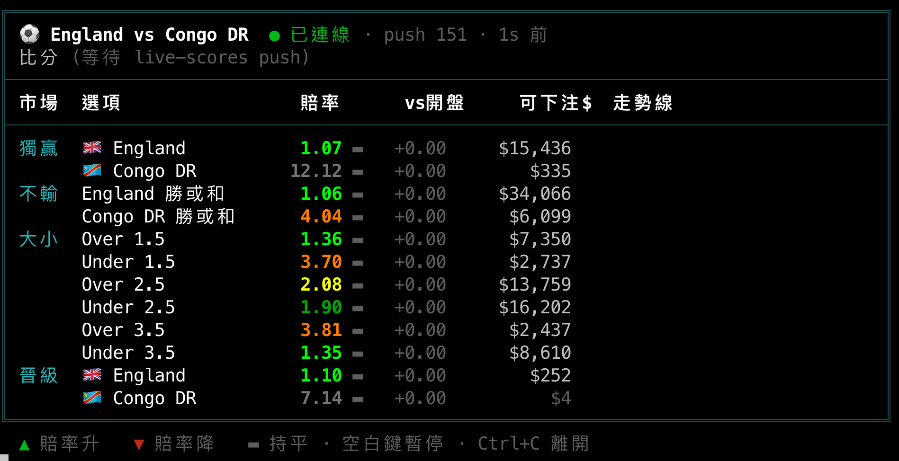
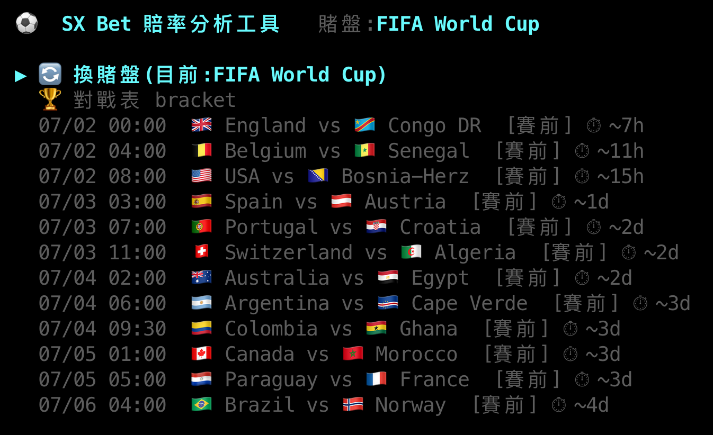
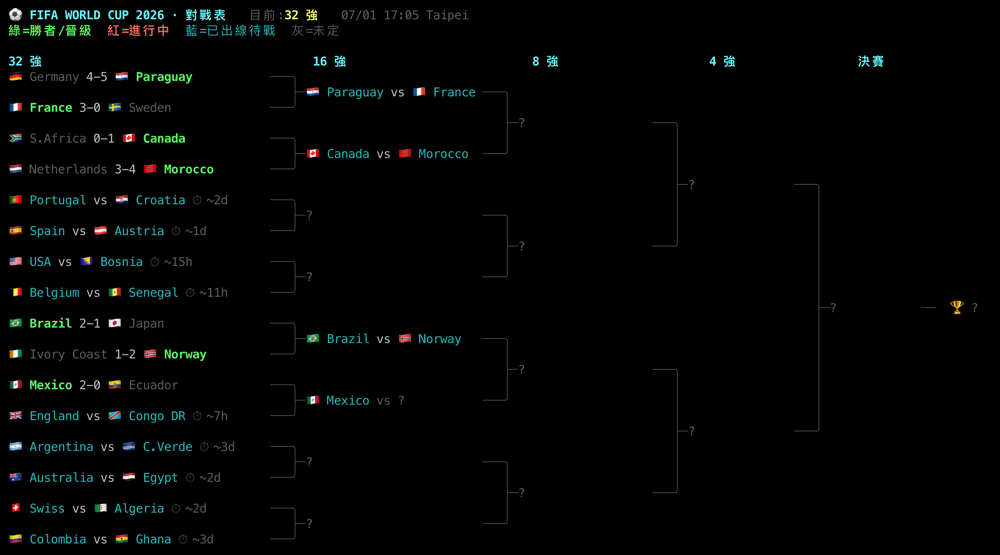

# fifa-2026 — SX Bet 世界盃 2026 賠率分析工具

一套針對 [SX Bet](https://sx.bet)（鏈上 betting exchange）的**唯讀**賠率分析工具，以 2026 世界盃為例。方向是「即時分析與資訊呈現，由人工下單」，刻意不做自動下單，也不把錢包私鑰交給程式。



## 這個專案的用途

這個 repo 主要是為了自己：

- **回來即時查盤**：下一場想下注時，直接跑工具看當下的賠率與盤面。
- **當作開發範本**：日後要做類似的分析工具時，可以參考這裡的做法（賠率換算、訂單簿處理、WebSocket 訂閱等）。
- **換賭盤也能沿用**：換其他比賽、甚至其他運動或賭盤時，改幾個參數就能重用同一套模式。

因為是 betting exchange（玩家對玩家撮合，而非莊家對賭），資料比傳統 sportsbook 完整：有雙向訂單簿、成交紀錄與即時推送，而且**讀取資料完全不需金鑰**。

## 工具一覽

| 檔案 | 功能 | 範例 |
|---|---|---|
| **`main.py`** | **互動式主入口**：**階層式選單**（↑/↓ 移動、→ 進入、← 返回）。第 1 層賽程清單 → 選一場 → 第 2 層在該場做 賠率/即時/數據/完整分析;可**換賭盤**（預設世界盃） | **`./start.sh`** |
| `sx.py` | 賽程與完整賠率板：獨贏、1X2、不輸（double chance）、讓分、大小、晉級，附 vig、可下注流動性與成交量（`--league` 可換聯賽） | `python3 sx.py games --days 4`<br>`python3 sx.py odds --date 2026-07-04` |
| `live_ws.py` | 即時盤口 dashboard，走 **Centrifugo WebSocket** 推送（實測約每秒 4 次） | `python3 live_ws.py L19315552` |
| `live.py` | 即時盤口 dashboard 的輪詢版，免金鑰、免安裝，可當 fallback | `python3 live.py L19315552` |
| `watch_ev.py` | 盤中**下注警報監看**：比分 + 大小盤賠率 +（選填）API-Football 射門/xG/控球；進球或終場即時印出並退出（4 秒 debounce 防 feed 抖動/VAR 假訊號），設計成背景跑、觸發即通知 | `python3 watch_ev.py L19427178 1 0 1582681` |
| `stats.py` | 球隊 WC2026 戰績，多來源**交叉驗證**（僅世界盃） | `python3 stats.py matchup "Mexico" "Ecuador"` |
| `bracket.py` | 終端機**對戰表**：32 強 → 決賽全圖，含比分 / 時間 / 晉級國家（僅世界盃） | `python3 bracket.py` |

所有賠率都是 **taker 十進位賠率**（實際下注拿到的那個數字），已對 sx.bet 網站的顯示校準過。時間一律為台北時間（UTC+8）。

**介面特色**：隊名帶**國旗 emoji** 🇧🇷🇩🇪🇲🇽;未賽場次顯示**開賽倒數**（`⏱ 3h12m`）;賠率板全面**上色 + 隱含機率長條 + 最愛高亮**;`main.py` 用 **↑/↓ 方向鍵**操控、首頁顯示 LIVE / 接下來焦點;`live_ws.py` 每個盤口附**走勢 sparkline** ▁▂▃▅▇;抓資料時有**載入動畫**;對戰表**自適應終端寬度**。共用工具在 `common.py`。

## 畫面

頂圖為即時盤口 dashboard(賠率五段配色、隱含機率長條、走勢 sparkline)。

主選單 — 方向鍵操控(↑/↓ 移動、→ 進入、← 返回),依賭盤列出全部賽程與開賽倒數:



對戰表 bracket — 32 強 → 決賽,含國旗、比分、晉級國家、開賽倒數:



## 快速開始

```bash
# 最簡單:啟動腳本(免記 python3),用選單操作
./start.sh
# 等同於 python3 main.py

# 或單獨呼叫各工具,例如純看 SX 賠率(不需任何設定):
python3 sx.py games --days 4

# 進階功能需先裝套件 / 填金鑰:
python3 -m pip install websocket-client    # live_ws.py 的 WebSocket 需要
cp .env.example .env                        # stats.py / live_ws.py 需要金鑰,.env 不會進 git
```

`.env` 用到的金鑰都能免費申請：

- `FOOTBALL_DATA_TOKEN`：到 [football-data.org](https://www.football-data.org/client/register) 免費註冊，`stats.py` 會用到。
- `SX_API_KEY`：在 [sx.bet](https://sx.bet) 帳號內產生，**只有 `live_ws.py` 的 WebSocket 需要**。
- `APISPORTS_KEY`：到 [api-sports.io](https://dashboard.api-football.com/register) 免費註冊，**選用**，`watch_ev.py` 要顯示盤中射門/xG/控球數據時才用到（免費 100 req/日；同一人開多個免費帳號會被停權，用一個即可）。

## 資料來源

- **SX Bet API**：賠率、訂單簿、成交、即時推送（Centrifugo WebSocket）。
- **football-data.org（主源）** 搭配 **TheSportsDB（交叉驗證）**：球隊戰績，兩個來源比分一致才採用。
- **API-Football（api-sports.io，選用）**：SX 沒有的**盤面/深度數據**（in-play 射門、射正、xG、控球、陣容、傷兵、時間軸），`watch_ev.py` 與盤中分析會用到。

## 設計原則與注意事項

- **唯讀，不下單**：SX 的 API 其實可以程式化下單，但需要錢包私鑰簽名，本專案刻意不碰，改由人工下單。
- **沒有歷史賠率 API**：SX 不提供賠率的歷史走勢，要看趨勢得自己輪詢或訂閱後落地記錄。
- **費率與市場特性**：單場直注的 maker 與 taker 手續費皆為 0%，串關則收 5%（以獲利計）；vig 極低（約 1%），屬於效率高的 sharp 市場。
- **可換賭盤 / 世界盃結束後**：`main.py` 的「換賭盤」可切到任何運動與聯賽（賠率、即時盤口都通用）；世界盃結束後賽程會是空的，程式會提示你換到其他進行中的聯賽,不會出錯。**球隊數據（`stats.py`）目前只綁世界盃**，切到其他聯賽時會自動略過並提示。

## 免責聲明

僅供研究與教育用途。運動博弈有風險，任何下注決策請自行判斷，盈虧自負。
